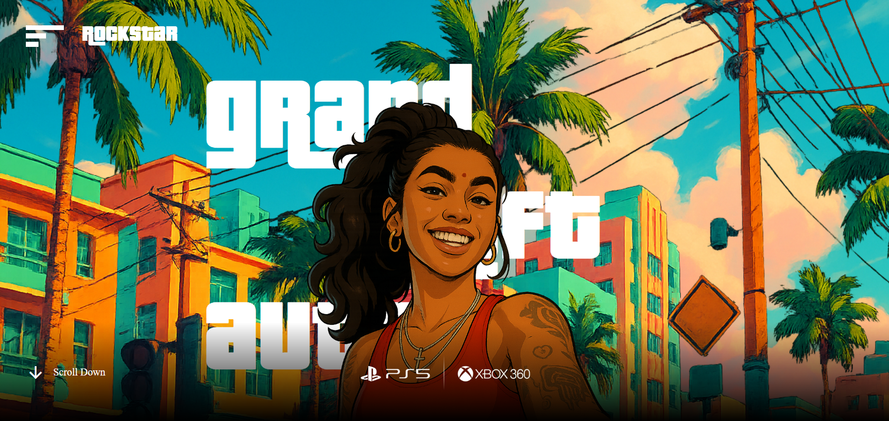

# GTA VI Inspired Landing Page

## 🚀 Project Overview
A fun animated landing page built with React, GSAP, and Tailwind CSS, inspired by the UI styles of Alexandra Troin & Harshavardhan Sharma. Features dramatic scaling, rotation animations, parallax-like mouse moves, and transitions into a Vice City themed hero section.

## ✨ Features
- **GSAP animations**: scaling, rotating, masking text reveal
- **Parallax mouse movement**: moves background, sky, and text based on cursor
- **Fully responsive layout** with Tailwind
- **Cool animated character & text sections** with Vice City vibes
- Inspired by UI/UX shots by Alexandra Troin & Harshavardhan Sharma

## 🛠️ Tech Stack
- React (with functional components + hooks)
- GSAP & @gsap/react for animation
- Tailwind CSS
- Remix Icons for quick icons

## 🖼️ Screenshots
- 
- 

## 📂 How to run
```bash
npm install
npm run dev
```

## ⚡ Files & structure
```
App.jsx (main component with GSAP animations)
public/
  ├─ bg.png
  ├─ sky.png
  ├─ char.png
  ├─ imag.png
  ├─ ps5.png
index.css (Tailwind setup)
```
_You can customize the images to match your own theme._

## ❤️ Credits
- UI Inspiration: [Alexandra Troin](https://www.linkedin.com/in/unicorpdesign/), [Harshavardhan Sharma](https://www.linkedin.com/in/harshvandanasharma/)
- Fonts: GTA styled fonts

---
> ✅ **Tip:** For smoother experience, tweak GSAP delays and scales to fit your preferred transitions.


